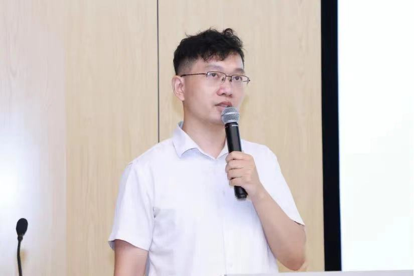
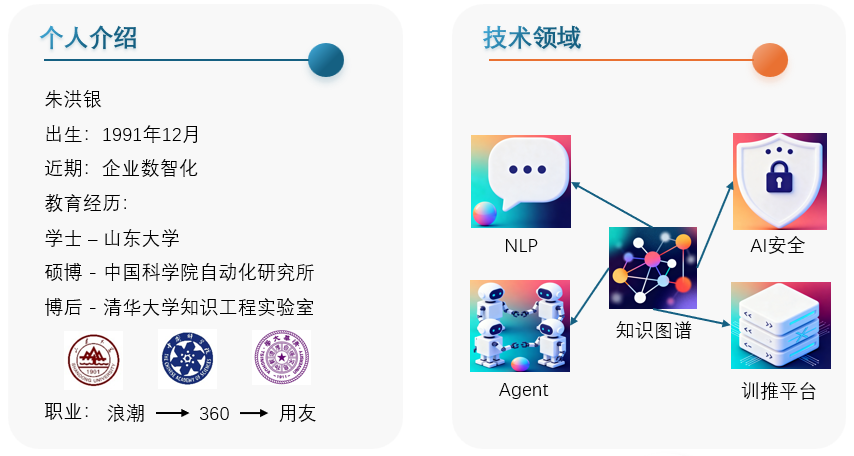

## 朱洪银

* 近期项目：企业数智化
* 联系方式：hongyin_zhu@163.com
* 联系地址：北京市海淀区上地信息路
* 个人简介：语言与知识计算专委会委员，博士毕业于中国科学院自动化研究所，清华大学（知识工程实验室）博士后。曾担任奇虎360、用友网络算法专家，浪潮集团主任工程师、高端服务器系统全国重点实验室研究员；在知识图谱、自然语言处理、多智能体协同、AI搜索、AI安全、高性能计算等技术领域具备丰富的研发与落地经验；迄今已发表SCI/EI论文20余篇，申请发明专利20余项。
* 出版专著：《高频算法设计》（[中国水利水电出版社](https://www.waterpub.com.cn/)）优惠券：[抖音](https://haohuo.jinritemai.com/ecommerce/trade/detail/index.html?id=3783446309776785892&origin_type=605&pd_hide_footer=1)、 [京东](https://u.jd.com/pDTKxJ0)、[领红包](https://u.jd.com/pDTG2cj)

## 1 研究兴趣

### 1.1 大语言模型

1. Zhu et al., 发明专利：大模型安全防护方法、装置、设备及存储介质, CN202510897999.2
2. Zhu et al., 发明专利：信息检测方法、装置、设备、存储介质及产品, CN202510875037.7
1. Zhu et al., 发明专利：回答生成方法、装置、设备、存储介质及产品, CN202510179924.0
2. Zhu et al., 发明专利：大模型优化方法、装置、设备及存储介质, CN202510437117.4
1. Zhu et al. Pre-training Graph Autoencoder Incorporating Hierarchical Topology Knowledge, Arxiv, 2024
1. Zhu. Reranking Passages with Coarse-to-Fine Neural Retriever Enhanced by List-Context Information, Journal of Artificial Intelligence and Robotics, 2024
1. Zhu et al. Climate Change from Large Language Models, Arxiv, 2023
1. Zhu et al., Pre-training Language Model Incorporating Domain-specific Heterogeneous Knowledge into A Unified Representation. Expert Systems with Applications, 2022  
1. Zhu et al., A Collaborative AI-Enabled Pretrained Language Model for AIoT Domain Question Answering. IEEE Transactions on Industrial Informatics, 2021  
1. Zhu. 融合常识与领域知识的预训练语言模型关键技术研究. 清华大学, 2022
1. Zhu et al., 发明专利：数据处理方法、装置、电子设备及计算机可读存储介质, CN202310492370.0 （申请美国专利） 
1. Zhu et al., 发明专利：图像检测方法、装置、电子设备及计算机可读存储介质, CN202310340822.3 （申请美国专利）
5. Zhu et al., 发明专利：一种文本信息处理方法、系统、设备及计算机存储介质, CN202310294417.2 （申请美国专利）
6. Zhu et al., 发明专利：一种文本检测方法、装置、设备、介质及系统, CN202310401835.7 （申请美国专利）
8. Zhu et al., 发明专利：推荐方法、模型训练方法、装置、设备既可读存储介质, CN202311284394.3（申请美国专利）
9. Zhu et al., 发明专利：信息获取方法、装置、设备、服务器及集群、存储介质, CN202311459391.9（申请美国专利）
1. Zhu et al., 发明专利：一种数据推送方法、装置、电子设备及存储介质, CN202311421339.4（申请美国专利）
2. Zhu et al., 发明专利：推荐方法、模型训练方法、装置、设备及可读存储介质, CN202311284394.3（申请美国专利）
3. Zhu et al., 发明专利：基于大语言模型的推荐模型的生成方法以及相应的产品, CN202311675494.9（申请美国专利）
4. Zhu et al., 发明专利：交互对象的推荐的方法和装置、存储介质及电子设备, CN202410283958.X（申请美国专利）

发布的大语言模型 [Huggingface社区](https://huggingface.co/hongyin)

### 1.2 知识图谱

1. Zhu H. Peer Review Report For: An ontology-driven knowledge graph for tourism information management. Open Research Europe 2025, 5:1 (https://doi.org/10.21956/openreseurope.19033.r50241)
1. Zhu. Node Classification via Semantic-Structural Attention-Enhanced Graph Convolutional Networks. Arxiv, 2023
1. Wan et al. Construction of Multimodal Dialog System via Knowledge Graph in Travel Domain, APWeb, 2023
1. Zhu et al., 基于实体语义聚合的常识知识图谱嵌入学习方法, CCKS, 2023
1. Zhu et al., SwitchNet: A modular neural network for adaptive relation extraction. Computers and Electrical Engineering, 2022  
2. Xie et al., Construction of Multi-modal Chinese Tourism Knowledge Graph. ICPCSEE, 2021  
3. Wen et al., 多策略中文开放关系抽取方法. CCKS, 2021  
7. Das et al., Breast cancer detection using an ensemble deep learning method, Biomedical Signal Processing and Control ,2021 
4. Tiwari et al., Distance-aware knowledge graph reasoning based on deep reinforcement learning. Neural Networks, 2020  
5. Wang et al., Structural block driven-enhanced convolutional neural representation for relation extraction. Applied Soft Computing, 2020
6. Zhu et al., FlexNER: A Flexible LSTM-CNN Stack Framework for Named Entity Recognition. NLPCC, 2019 
8. Li et al., 发明专利：一种旅游知识图谱模型确定方法及装置，CN202111372439.3
9. Li et al., 发明专利：常识知识评分和排序方法及装置，CN202210292415.5  
1. Li et al., 发明专利：一种旅游知识语义分析方法及装置，CN202111371152.9
2. Zhu et al., 发明专利：目标知识图谱嵌入方法、其装置及电子设备, CN202310970701.7（申请美国专利）
1. Zhu et al., 发明专利：一种图数据分类方法、系统、装置及介质, CN202310945202.2（申请美国专利）
3. Zhu et al., 发明专利：一种常识知识图谱的存储方法、系统, CN202311177003.8（申请美国专利）
4. Zhu et al., 发明专利：一种智慧城市数据处理方法、装置、设备及可读存储介质, CN202410078615.X（申请美国专利）

### 1.3 脑科学

1. Zhu et al., Species Classification for Neuroscience Literature Based on Span of Interest Using Sequence-to-sequence Learning Model. Frontiers in Human Neuroscience, 2020  
2. Zhu et al., Research Topics Variation Analysis and Prediction Based on FARO and Neural Networks. IEEE SMC, 2016
3. Zhu et al., Brain Knowledge Graph Analysis Based on Complex Network Theory. Brain Informatics, 2016  
4. Zhu et al., Relation Inference and Type Identification Based on Brain Knowledge Graph. Brain Informatics, 2016  
5. Zeng et al., User Interests Analysis and Its Application on the Linked Brain Data Platform. Brain Informatics, 2016  
6. Zhu et al., Brain Knowledge Engine. Advances in Neuroinformatics IV. AINI 2016. Conference Abstract: Demonstration Session  
1. Zhu. 基于神经科学文献感兴趣片段的跨物种脑认知知识图谱自动构建. 中国科学院大学, 2020
1. Zhu. 面向认知功能的脑区环路知识图谱自动构建. 中国科学院大学, 2017
7. Zhu et al., 发明专利：一种文献分析方法、系统、设备及存储介质, CN202311459391.9（申请美国专利）

### 1.4 其他主题

1. Lin et al. EFSC: An Efficient, Flexible and Secure Trading System for Computing Power Network, IEEE Conference on Local Computer Network (LCN), 2024
1. Liu et al. Integrating FPGA-based hardware acceleration with relational databases. Parallel Computing, 2024.
2. Liu et al. Neural Personalized Topic Modeling for Mining User Preferences on Social Media. CIKM, 2023

## 2 近期学术和产业动态

### 2.1 作报告
* [VexDB向量数据库产品发布会](https://mp.weixin.qq.com/s/97HKrJ8Zg6PhptR6OAM2yA). 2025.09，数智引航
* [智能生存指南：智能体时代如何避免被大模型反噬](https://mp.weixin.qq.com/s/xF8S9Db1XCvUGZyP9mI1Ng). 2025.07，中山大学
* [干一行AI一行 第二期](https://v.douyin.com/if5VoaqG/). 2025.1，"360短视频挑战赛"--潜力新星奖
* [干一行AI一行](https://www.bilibili.com/video/BV1Xzi6YNEdd/?share_source=copy_web&vd_source=067b9b1a035ce6f22c43ce131fd58ee1). 2024.12，“360短视频挑战赛”入围作品
* [人工智能应用大讲堂系列活动讲座](https://edu.bsia.org.cn/course/video?id=1866732791934214145)，2024.09. 北京软件和信息服务业协会（免费公开课程）
* [知识增强的高效大模型实践](https://finance.sina.com.cn/jjxw/2024-10-14/doc-incsnqmf1665433.shtml). 2024.09. [智谱AI、气象局](https://www.cma.gov.cn/2011xwzx/2011xqxkj/2011xkjdt/202410/t20241014_6636586.html)
* [智慧算力策略：大模型与知识图谱的协同探索. 2024.07](https://www.bsia.org.cn/site/content/27234.html), [北京化工大学](https://cist.buct.edu.cn/2024/0722/c981a196977/page.htm)
* 大模型时代的知识工程：从产业和技术角度. 2024.03，北京建筑大学
* 智慧计算知识图谱（加长版）. 2023.12.27，浪潮集团精品课程
* [大模型时代的知识工程研究进展](https://kjc.lzufe.edu.cn/info/1075/2011.htm). 2023.12.01，[兰州财经大学](https://mp.weixin.qq.com/s?__biz=MzUzODA1Nzg1OA==&mid=2247523531&idx=1&sn=5381c5a6df3bb7a5e7873314febef1d9&chksm=fadf5126cda8d8305b812605530ea6aef55e69ca0605ae8db99ccdef2b2fe071f8f0c68def06&scene=27)
* 3D AI大模型与文化遗产智慧系统. 2023.11.01, 中山大学
* 大模型时代的知识图谱研究进展. 2023.09.22，中山大学
* 智慧计算知识图谱. 2023.09，浪潮电子信息产业股份有限公司
* [数字人文知识图谱构建. 2022.10.05，中山大学](https://mp.weixin.qq.com/s?__biz=MzIyNTU2MTU2Mg==&mid=2247503871&idx=1&sn=56833448dcb3d92462ed0f212acc986d&chksm=e87f514adf08d85c7d90da4128781f97fd0afabd09105fffb3c1d2afa3d51d59609ec0ce3484&scene=27)
* [知识图谱, 2021.06, 沪东中华造船集团](https://www.cs.tsinghua.edu.cn/info/1031/4597.htm)
* [知识图谱, 2020.09, 酒泉卫星发射中心](https://postdoctor.tsinghua.edu.cn/info/zxjx/2031)

### 2.2 研究提案/指南
* [金融等垂直领域RAG技术]()
* [大模型预训练数据工程技术]()
* [多智能体技术研究]()
* [图基础模型技术研究]()
* [模型压缩技术研究]()
* [多模态大模型技术研究]()
* [大模型推理加速技术研究]()
* [脑结构连接降维与认知评分研究（脑科学）]()
* [图嵌入与检索加速技术研究](2024/doc/embedding.jpg)
* [基于多模态数据的大语言模型和图神经网络融合技术研究](2024/doc/2024-02.pdf)
* [面向人工智能模型的数据治理软硬件协同关键技术研究](2024/doc/2023-08.pdf)
* [数据中心服务器智能化管理系统](2024/doc/2022-12.pdf)
* [企业智能体](http://23.105.195.58:17862/index3.html)

### 2.3 参加活动
* [DeepSeek 爆了，AI应用机遇在哪？](https://mp.weixin.qq.com/s/KlL4DEVT1fuP3IkzoB0lYA)，[2025，北京](pic/2025/01.png)
* [AI新纪元破局向未来（SVIP），2024.12](pic/2024/10.jpg)，[北京](https://mp.weixin.qq.com/s/rLIE-SsV0aOou5yEXSDWxw)
* [极客公园创新大会 2025，2024.12，北京](pic/2024/09.png)
* [资本赋能新智生产力高质量发展（北京大学），2024.11，北京](pic/2024/08.png)
* [第一届风和论坛（智谱AI、气象局），2024.09，北京](pic/2024/07.png)
* [ISC.AI 2024--第12届互联网安全大会，2024.07，北京](pic/2024/06.jpg)
* [“人工智能应用大讲堂”系列活动第三期，算力困局与破局之道，2024.07，北京](https://mp.weixin.qq.com/s/guScjbB9QMGFUkb_ryWUrg)
* [摩根大通（JP Morgan）金融文档大模型研讨会，2024.03.20，北京](pic/2024/02.png)
* [第一届龙蜥操作系统大会 (OpenAnolis Conference 2023)，2023.12.17，北京](pic/2023/13.jpeg)
* [AICC 2023 人工智能计算大会，2023.11.29，北京](pic/2023/12.jpg)
* [存储服务器和GPU显卡库存，2023.10.31，北京](pic/2023/11.jpg)
* [中国企业家俱乐部，2023.9.27，北京](pic/2023/04.jpg)
* [第十七届全国知识图谱与语义计算大会，2023.08.24，沈阳](pic/2023/02.jpg)

### 2.4 担任以下国际期刊审稿人

* 人工智能领域：《[Expert Systems with Applications](https://www.sciencedirect.com/journal/expert-systems-with-applications)》，《[Information Fusion](https://www.sciencedirect.com/journal/information-fusion)》，《[IEEE Transactions on Neural Networks and Learning Systems](https://ieeexplore.ieee.org/xpl/RecentIssue.jsp?punumber=5962385)》，《[Neurocomputing](https://www.sciencedirect.com/journal/neurocomputing)》，《[Natural Language Processing Journal](https://www.sciencedirect.com/journal/natural-language-processing-journal)》等
* Nature旗下：《[Scientific Reports](https://www.nature.com/srep/)》,《[Social Network Analysis and Mining](https://link.springer.com/journal/13278)》,《[International Journal of Data Science and Analytics](https://link.springer.com/journal/41060)》,《[Knowledge and Information Systems](https://link.springer.com/journal/10115)》，《[The Journal of Supercomputing](https://link.springer.com/journal/11227)》，《[Artificial Intelligence Review](https://link.springer.com/journal/10462)》，《[International Journal on Document Analysis and Recognition](https://link.springer.com/journal/10032)》，《[BMC Medical Informatics and Decision Making](https://bmcmedinformdecismak.biomedcentral.com/)》，《[Journal of Big Data](https://journalofbigdata.springeropen.com/)》，《[Journal of Intelligent Information Systems](https://link.springer.com/journal/10844)》等
* 交叉领域：《[Intelligence-Based Medicine](https://www.sciencedirect.com/journal/intelligence-based-medicine)》，《[Computers, Materials & Continua](https://www.techscience.com/journal/cmc)》，《[PLOS ONE](https://journals.plos.org/plosone/)》，《[Open Research Europe](https://open-research-europe.ec.europa.eu/)》，《[Computers and Electrical Engineering](https://www.sciencedirect.com/journal/computers-and-electrical-engineering)》
* 担任期刊编委：《Journal of Artificial Intelligence and Robotics》，《Machine Learning in Engineering and Technology》
  
## 友情链接
1. [谷歌学术](https://scholar.google.ru/citations?user=LXXoB3QAAAAJ&hl=en)
2. [DBLP](https://dblp.org/pid/186/4399.html)
3. [Semantic scholar](https://www.semanticscholar.org/author/Hongyin-Zhu/3465702)

