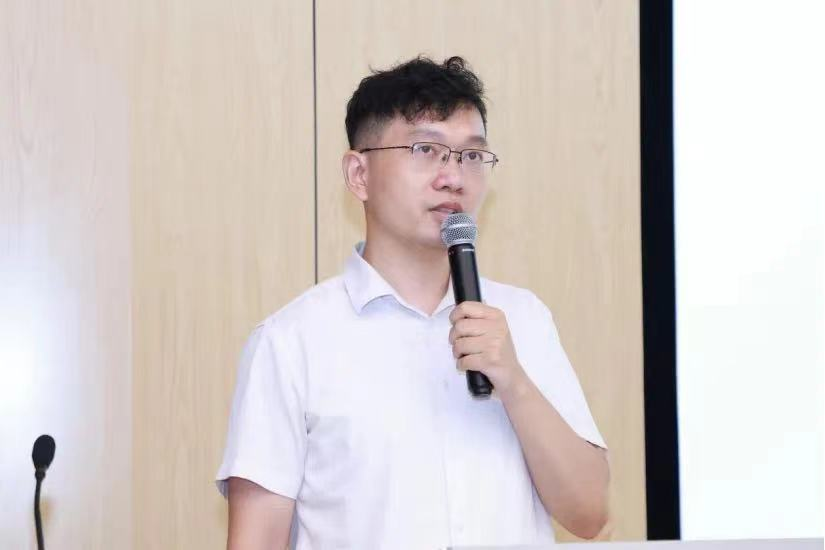

<!-- Banner -->
<p align="center">

</p>

<h1 align="center">朱洪银</h1>

<p align="center">
<b>神经符号知识推理 × Frontier AI</b><br/>
态势感知 / 安全运营 / Agentic AI 方法论
</p>

---

## 🧭 关于我

- 💻 **H3C（新华三 / 紫光股份）** · 高级系统专家，研究领域为态势感知与安全运营，技术方法论为 Agentic AI
- 📚 发表 SCI/EI 论文 30+ ｜ 授权发明专利 30+ ｜ 专著《高频算法设计》作者
- 🌐 长期主线：**Frontier AI → 可信、稳定的 Agent 系统**

> 将大模型、知识图谱与本体工程结合，探索**可信、稳定**的 Agent 系统——让 Agent 自主执行任务、操作数据，全程可审计。

---

## 🔥 当前研究重点

- 🛰️ **态势感知与安全运营（Situational Awareness & Security Operations）**：以 Agentic AI 为方法论，构建感知—研判—响应的智能体工作流，驱动 Agent 执行任务、操作数据，支撑安全运营闭环
- 🛡️ **Agentic AI 安全（Agentic AI Security）**：提示注入与越狱防御、工具调用安全、智能体红队评测、智能体行为监控与研判

**长期研究主线**：

- 🧠 **知识表示与推理（KRR）→ 神经符号与知识增强推理（Neuro-symbolic & Knowledge-enhanced Reasoning）**：提出 LOM（Large Ontology Model），研究本体约束推理、GraphRAG，面向*可信 Agent 系统*

---

## 🧪 代表性研究

### 🧠 大模型 / LOM
- **From Business Events to Auditable Decisions** —— 基于本体约束的企业决策图模拟（arXiv 2026）
- **Unifying Ontology Construction and Semantic Alignment** —— 面向确定性推理的统一本体建模框架（arXiv 2026）
- **Large Ontology Models for Enterprise Knowledge Management**（arXiv 2026）
- 图谱增强的大模型可控可信解码（ESWA 2026）
- 层次结构知识增强的图自编码预训练（ESWA 2024）
- 融合领域知识的预训练语言模型（ESWA 2022）
- 面向 AIoT 的协同问答模型（IEEE TII 2021）

📌 开源项目：https://github.com/liftkkkk （OWL MCP Server、x2md 等）

### 🔗 知识图谱
- 语义结构联合建模的图神经网络（2023）
- 多模态对话知识图谱（APWeb 2023）
- SwitchNet 关系抽取模型（2022）
- FlexNER 命名实体识别（2019）

### 🧠 脑科学与认知智能
- 脑知识图谱构建与推理（Brain Informatics）
- 神经科学文献挖掘（Frontiers）

---

## 🏗️ 产业经验

- 🟡 **H3C（新华三 / 紫光股份）**：高级系统专家 ｜ 态势感知 / 安全运营 / Agentic AI 方法论
- 🟡 **用友网络**：AI Lab 负责人 / 模型研发负责人 / 算法专家
- 🟢 **奇虎360**：算法专家
- 🔵 **浪潮**：高效能服务器与存储技术国家重点实验室研究员 / 主任工程师
- 🟣 **彩讯股份**：总监 / 北京分公司 AI 负责人

> 技术路线为**大小模型协同**：LLM 可信推理与可控生成、Agent 系统构建；小模型（ML/DL）训练按场景取用。

---

## 🧩 技术能力

```text
LLM 可信推理与生成        ████████████████
大小模型协同              ████████████████
Agentic AI 安全           ████████████████
神经符号与知识推理        ████████████████
本体建模（LOM）           ████████████████
```

---

## ☕ 支持我的开源工作

我在业余时间维护着多个开源项目（OWL MCP Server、x2md 等），全部免费开放。

如果我的项目或论文对你的工作、研究有过帮助，欢迎请我喝杯咖啡——
每一份支持都会投入到新项目的开发与现有项目的长期维护中。

<p align="center">

</p>

<p align="center">
<i>赞赏时留言你在用哪个项目，你的需求会被优先考虑 ☕</i>
</p>

也欢迎其他形式的支持：给项目点 ⭐ Star、引用相关论文、或在 Issue 中反馈问题。
